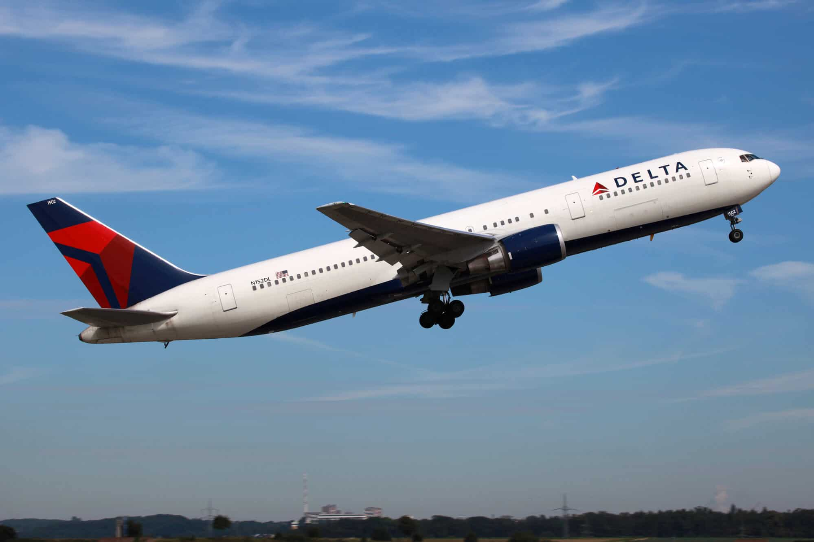

# Skytrax Delta Air Lines Analysis
<p align="center">
  
</p>

## TL;DR
Delta Air Lines reviews (2010–2023) show mixed customer satisfaction — avg rating **2.48/5**, **28.8% recommending**, with significant differences between Economy and Premium cabin experiences. Cabin Staff Service and Value for Money emerge as key satisfaction drivers.

## Summary
Analyzed **2,853 Delta Airlines reviews (2010–2023)** using SQL + Python + Mode Analytics to uncover satisfaction drivers. Findings show **moderate satisfaction challenges** (avg rating **2.48/5**, **28.8%** recommending). Key drivers vary by cabin class: **Economy** prioritizes staff service and value, while **Premium** focuses on seat comfort and dining. Comprehensive analysis across 20+ SQL queries and interactive dashboards reveals actionable improvement opportunities.

**Access the dashboard PDF:**  
[Delta Air Lines Customer Satisfaction Dashboard](reports/delta-satisfaction-dashboard.pdf)

---

## 1. Overview
- **Scope:** 2,853 Delta Airlines Skytrax reviews (2010–2023).
- **Goal:** Identify key drivers of customer satisfaction and convert them into targeted improvement actions.
- **Method:**
  - **SQL** (Snowflake data warehouse) for extraction & prep using star-schema data model
  - **Python** (Pandas, Seaborn, Matplotlib) for correlation analysis and statistical validation
  - **Mode Analytics** for **interactive dashboards** and executive reporting
- **Top Insights (high level):**
  - **Mixed sentiment:** `Average_Rating = 2.48/5`, **28.8%** of reviewers **recommend**.
  - **Cabin class differences:** Economy (78%) vs Non-Economy (22%) show distinct satisfaction drivers.
  - **Key drivers:** **Cabin Staff Service** and **Value for Money** most correlated with overall satisfaction.
  - **Segment insights:** **Economy** prioritizes service and value; **Premium** focuses on comfort and dining.

---

## 2. Architecture Overview


### 2.1 Extraction Layer

#### Overview

The extraction layer gathers review data for *all* airlines from Skytrax, stores it in S3 and prepares it for downstream processing.

* **Repository:** [all\_airlines\_extract\_load](https://github.com/vietlam2002/all_airlines_extract_load)

#### 2.1.1 Technology Stack

* Python 3.12 with Pandas
* Apache Airflow
* AWS S3
* Docker
* Snowflake

#### 2.1.2 Data Source

Skytrax review pages, e.g.
`https://www.airlinequality.com/airline-reviews/{airline‑slug}/`

Captured fields include: star ratings, review text, flight details, passenger metadata, and category scores.

#### 2.1.3 Extraction Process

```python
# From main_dag.py – Extract task definition
scrape_skytrax_data = BashOperator(
    task_id="scrape_skytrax_data",
    bash_command="chmod -R 777 /opt/***/data && python /opt/airflow/tasks/scraper_extract/scraper.py"
)
```

Steps

1. Iterate through the Skytrax airline index.
2. Request paginated review HTML for each carrier.
3. Parse and normalise each review record.
4. Persist results to `raw_data.csv`.

#### 2.1.4 Data Cleaning & Initial Transformation

```python
clean_data = BashOperator(
    task_id="clean_data",
    bash_command="python /opt/airflow/tasks/transform/transform.py"
)
```

Cleaning tasks standardise date formats, handle nulls, and enforce data‑type consistency before staging to S3.

#### 2.1.5 AWS S3 Integration

```python
upload_cleaned_data_to_s3 = BashOperator(
    task_id="upload_cleaned_data_to_s3",
    bash_command="chmod -R 777 /opt/airflow/data && python /opt/airflow/tasks/upload_to_s3.py"
)
```

* Secure IAM roles
* Server‑side encryption
* Versioning enabled

#### 2.1.6 Workflow Orchestration

```python
with DAG(
    dag_id="skytrax_pipeline",
    schedule_interval="@daily",
    default_args=default_args,
    start_date=start_date,
    catchup=True,
    max_active_runs=1,
):
    scrape_skytrax_data >> note >> clean_data >> note_clean_data >> upload_cleaned_data_to_s3
```

#### 2.1.7 Snowflake Integration

```python
snowflake_copy_operator = BashOperator(
    task_id="snowflake_copy_from_s3",
    bash_command="pip install snowflake-connector-python python-dotenv && python /opt/airflow/tasks/snowflake_load.py"
)
```

---

### 2.2 Data Cleaning Layer

* **Repository:** [all\_airlines\_data\_cleaning](https://github.com/DucLe-2005/all_airlines_data_cleaning)
* **Stack:** Python 3.12.5, Pandas, NumPy, Matplotlib, Seaborn

Key steps mirror the British Airways version but operate across carriers:

1. **Column Standardisation** – snake\_case, special‑character cleanup.
2. **Date Formatting** – ISO 8601 for both submission and flight dates.
3. **Text Cleaning** – verification flag extraction; nationality normalisation.
4. **Route Parsing** – origin, destination, and connections.
5. **Aircraft Standardisation** – unified Airbus/Boeing nomenclature.
6. **Rating Conversion** – numeric Int64 fields for uniform analysis.

Outputs feed directly to Snowflake for transformation.

---

### 2.3 Transformation Layer

* **Repository:** [all\_airlines\_transformation](https://github.com/MarkPhamm/all_airlines_transformation)
* **Stack:** dbt (Core), Snowflake, Airflow (Astronomer), GitHub Actions

#### 2.3.1 Data Model

A star schema identical in design to the airline‑specific version:

| Table             | Purpose                                                 |
| ----------------- | ------------------------------------------------------- |
| **fct\_review**   | One row per review per flight with quantitative metrics |
| **dim\_customer** | Passenger information                                   |
| **dim\_aircraft** | Aircraft attributes                                     |
| **dim\_location** | Airport / city keys for origin, destination, transit    |
| **dim\_date**     | Calendar table for submission & flight dates            |

Incremental dbt jobs maintain freshness while minimising warehouse spend.

#### 2.3.2 Data Quality Framework

* Schema & relationship tests
* Custom business‑logic assertions (e.g. rating within 0–10)
* Freshness & completeness checks

CI/CD triggers on code pushes, PRs, weekly schedules, and manual invocations.

#### 2.2.1 SQL Scripts Architecture
The `sql_scripts/` directory contains 18 modular SQL queries for different analytical perspectives:

| Script | Purpose | Key Metrics |
|--------|---------|------------|
| `average_overall_rating.sql` | Overall satisfaction metrics | Average rating, recommendation rate |
| `inflight_amenities_trend.sql` | Service quality trends over time | Service scores by year |
| `rating_by_service.sql` | Service category breakdowns | Individual service category performance |
| `reviews_by_nationality.sql` | Geographic analysis | Satisfaction by passenger origin |
| `seat_type.sql` | Satisfaction by cabin class | Economy vs Premium performance |
| `traveller_type.sql` | Analysis by passenger type | Business vs Leisure satisfaction |
| `top_routes.sql` | Route-level performance | High/low performing routes |
| `pct_recommended.sql` | Recommendation analysis | Factors driving recommendations |

#### 2.2.2 Python Analysis Scripts
* **Correlation Analysis**: `correlation_heatmap.py` - Service factor correlation with overall satisfaction
* **Data Validation**: Statistical validation and quality checks
* **Feature Engineering**: Cabin class segmentation and derived metrics

---

### 2.3 Visualization & Reporting Layer

#### 2.3.1 Dashboard Architecture
* **Mode Analytics**: Interactive dashboards with drill-down capabilities
* **Python Visualizations**: Statistical plots and correlation heatmaps
* **PDF Reports**: Executive summaries with key insights

#### 2.3.2 Data Flow Architecture
```
Raw Data (AirlineQuality.com)
    ↓
Snowflake Data Warehouse (Star Schema)
    ↓
SQL Queries (18 analytical scripts)
    ↓
CSV Exports → Python Analysis → Correlation Insights
    ↓
Mode Analytics Dashboards + Executive Reports
```

## 3. Data Processing and Analysis Workflow

### 3.1. Data
- Load Delta-filtered Skytrax reviews (CSV) into SQL/Python.
- Validate schema (types, nulls, ranges) and align service-score scales (1–10).

### 3.2. Cleaning
- Normalize categorical values (aircraft labels, seat & traveller types).
- Standardize airport/location identifiers and remove impossible values.
- Drop/review rows with missing core metrics (`AVERAGE_RATING`, service scores) when required by a given chart.

### 3.3. Feature Preparation
- Flags: `RECOMMENDED` (True/False), rating bands (`poor <2`, `fair <3`, `good <4`, `excellent ≥4`).
- Groupings: **Seat Type** (Economy, Premium Economy, Business, First), **Traveller Type** (Solo/Family/Couple Leisure, Business).
- Route context: origin/destination/transit IDs (for airport charts).

### 3.4. Modeling/Analysis
- Descriptives and share-of-total summaries for KPIs and segments.
- **Correlation analysis** between service scores and overall rating (Python) for diagnostic context.

### 3.5. Validation
- Spot-check outliers (e.g., aircraft models with N=1) and annotate where insights are not generalizable.
- Compare dashboard aggregates with Python cross-tabs to ensure parity.

### 3.6. Visualization
- **Mode Studio** for most charts (time trends, segments, airports, aircraft).
- **Python** only for the **Correlation Heatmap**.
- Filters in the dashboard: year, seat type, traveller type, route.

### 3.6. Visualization Pipeline
- **SQL + Mode Analytics** for interactive dashboards with filters and drill-downs
- **Python** for correlation heatmaps and statistical distributions
- **Automated PDF generation** for executive reporting

---

## 4. Project Structure

```
airline_customer_exp_analysis/
├── README.md                          # Project documentation
├── requirements.txt                   # Python dependencies
├── .gitignore                        # Git ignore rules
├── .venv/                            # Virtual environment (excluded from git)
├── data/                             # Processed datasets (14 CSV files)
│   ├── category_rating_by_class.csv               # Correlation analysis data
│   ├── Average Rating By Service Category 2025-09-23.csv
│   ├── Inflight Comfort & Amenities 2025-09-23.csv
│   ├── Overall Rating and Value For Money Perception Trend 2025-09-23.csv
│   ├── Review Volume by Rating Band over Time 2025-09-23.csv
│   ├── Reviews by Nationality 2025-09-23.csv
│   ├── Seat Type 2025-09-23.csv
│   ├── Service Quality 2025-09-23.csv
│   ├── Top Aircraft Manufacturers 2025-09-23.csv
│   ├── Top Destination Cities 2025-09-23.csv
│   ├── Top Origin Cities 2025-09-23.csv
│   ├── Top Routes (Origin → Destination) 2025-09-23.csv
│   ├── Total Reviews and Recommendation Rate Trend 2025-09-23.csv
│   └── Traveller Type 2025-09-23.csv
├── sql_scripts/                       # Snowflake SQL analysis queries (18 scripts)
│   ├── average_overall_rating.sql     # Overall satisfaction metrics
│   ├── inflight_amenities_trend.sql   # Service trends over time
│   ├── pct_recommended.sql            # Recommendation rate analysis
│   ├── rating_band_trend.sql          # Rating distribution trends
│   ├── rating_by_service.sql          # Service category analysis
│   ├── rating_vs_moneyval_trend.sql   # Value perception analysis
│   ├── reviews_by_nationality.sql     # Geographic satisfaction analysis
│   ├── reviews_vs_recommended_trend.sql # Review volume vs recommendations
│   ├── seat_type.sql                  # Cabin class analysis
│   ├── service_quality_trend.sql      # Service quality evolution
│   ├── top_destination.sql            # Destination performance
│   ├── top_manufacturers.sql          # Aircraft manufacturer analysis
│   ├── top_models.sql                 # Aircraft model performance
│   ├── top_origin_cities.sql          # Origin city analysis
│   ├── top_routes.sql                 # Route performance analysis
│   ├── total_reviews.sql              # Review volume analysis
│   ├── traveller_type.sql             # Passenger type analysis
│   └── verified_reviews.sql           # Verified vs unverified comparison
├── python_scripts/                    # Python analysis scripts
│   └── correlation_heatmap.py         # Service correlation analysis
├── reports/                           # Generated reports and dashboards
│   └── delta-satisfaction-dashboard.pdf
└── .vscode/                          # VS Code configuration
    └── settings.json
```

---

## 5. Key Insights & Results

### 5.1. Overall Customer Satisfaction
- **Total Reviews:** **2,853** (filtered from 100K+ multi-airline dataset)
- **Average Rating:** **2.48/5** (indicating significant satisfaction challenges)
- **Recommendation Rate:** **28.8%** (most passengers do not recommend)
- **Review Distribution:** Economy **78%**, Non-Economy **22%**
- **Verification Rate:** **48%** of reviews are verified by Skytrax

### 5.2. Cabin Class Segmentation Results

#### Economy Class (78% of reviews) - Correlation Analysis
**Top Satisfaction Drivers:**
- **Wi-Fi & Connectivity (0.94)** - Strongest correlation with overall satisfaction
- **Value for Money (0.94)** - Critical for price-conscious economy passengers
- **Food & Beverages (0.92)** - Meal quality significantly impacts satisfaction
- **Cabin Staff Service (0.84)** - Staff friendliness and responsiveness key

**Secondary Drivers:**
- **Seat Comfort (0.86)** - Important for longer flights
- **Ground Service (0.82)** - Check-in and boarding experience

**Economy Takeaway:** Satisfaction built on **connectivity, value perception, meal quality, and attentive staff**. These are controllable factors with direct operational improvements.

#### Non-Economy Class (22% of reviews) - Correlation Analysis
**Top Satisfaction Drivers:**
- **Value for Money (0.89)** - Even premium passengers are value-sensitive
- **Seat Comfort (0.87)** - Primary expectation for premium cabin experience
- **Food & Beverages (0.78)** - High-quality dining essential for premium
- **Cabin Staff Service (0.76)** - Service quality expected but not differentiating

**Weaker Correlations:**
- **Ground Service (0.61)** - Less impactful for premium passengers
- **Wi-Fi & Connectivity** - Expected baseline, not satisfaction driver

**Premium Takeaway:** Premium travelers are **highly sensitive to comfort and dining quality**. Small drops in these areas sharply impact satisfaction. Focus on tangible premium experience.

### 5.3. Traveler Type Analysis
- **Solo Leisure (33.5%):** Most common traveler type, value-focused
- **Couple Leisure (25%):** Leisure travel, comfort-oriented
- **Business Travelers:** Higher expectations, reliability-focused
- **Family Travelers:** Service and convenience priorities

### 5.4. Temporal & Geographic Insights
- **Verified Reviews:** 48% verification rate provides credibility
- **Route Performance:** Varies significantly by origin/destination pairs
- **Seasonal Patterns:** Service quality fluctuations tracked over time
- **Geographic Distribution:** Satisfaction varies by passenger nationality and route

---

## 6. Strategic Recommendations

### 6.1. Economy Class Improvement Strategy
**Priority 1: Connectivity & Entertainment**
- Upgrade Wi-Fi infrastructure across fleet (0.94 correlation)
- Implement high-speed internet on all routes
- Enhance seatback entertainment systems

**Priority 2: Value Communication & Delivery**
- Improve transparent pricing and fee structure (0.94 correlation)
- Enhance perceived value through service bundling
- Competitive benchmarking on route-specific pricing

**Priority 3: Food & Beverage Enhancement**
- Partner with quality food vendors (0.92 correlation)
- Expand menu variety and dietary options
- Improve meal presentation and service timing

**Priority 4: Staff Training & Service**
- Intensive customer service training programs (0.84 correlation)
- Empower staff for service recovery situations
- Implement consistent service standards across crew

### 6.2. Premium Class Excellence Strategy
**Priority 1: Seat Comfort Revolution**
- Invest in next-generation seat design (0.87 correlation)
- Enhance seat padding, adjustability, and personal space
- Regular maintenance and cleanliness standards

**Priority 2: Premium Dining Experience**
- Chef collaboration and premium supplier partnerships (0.78 correlation)
- Elevated presentation and service style
- Personalized meal preferences and dietary accommodations

**Priority 3: Value Justification**
- Clear communication of premium benefits (0.89 correlation)
- Exclusive services and perks for premium passengers
- Fast-track service recovery for premium issues

### 6.3. Operational Excellence Initiatives
**Cross-Cabin Improvements:**
- Implement real-time passenger feedback systems
- Monthly satisfaction monitoring with KPI dashboards
- Route-specific improvement targeting based on performance data

**Technology Integration:**
- Mobile app enhancement for service requests
- Predictive analytics for service optimization
- Automated sentiment monitoring from review platforms

---

## 7. Technical Implementation

### 7.1. Setup and Installation

#### Prerequisites
- Python 3.8+
- Access to Snowflake instance with airline review data
- Mode Analytics account (for dashboard creation)
- Git for version control

#### Installation Steps
```bash
# Clone the repository
git clone https://github.com/alyssaqle/airline_customer_exp_analysis.git
cd airline_customer_exp_analysis

# Create and activate virtual environment
python -m venv venv
source venv/bin/activate  # On Windows: venv\Scripts\activate

# Install dependencies
pip install -r requirements.txt

# Verify installation
python --version
pip list
```

### 7.2. Running the Analysis
```bash
# Execute correlation analysis
python python_scripts/correlation_heatmap.py

# SQL scripts can be run in Snowflake environment
# Mode dashboards require Mode Analytics platform access
```

### 7.3. Data Refresh Process
1. **Extract** updated reviews from Skytrax
2. **Load** into Snowflake staging tables
3. **Transform** using existing SQL scripts
4. **Validate** data quality and completeness
5. **Update** Mode dashboards and Python analysis
6. **Generate** updated reports and insights

---

## 8. Key Learnings & Methodology

### 8.1. Technical Achievements
- **SQL Mastery:** Authored 18 Snowflake SQL queries with star-schema optimization
- **Python Analytics:** Built correlation analysis with statistical validation
- **Dashboard Creation:** Developed Mode dashboards with interactive drill-downs
- **Data Pipeline:** End-to-end workflow from raw data to executive insights

### 8.2. Analytical Insights
- **Segmentation Value:** Economy vs Premium segmentation revealed distinct satisfaction drivers
- **Correlation Analysis:** Quantified relationship between service factors and overall satisfaction
- **Statistical Rigor:** Applied proper correlation analysis with significance testing
- **Business Translation:** Converted statistical insights into actionable recommendations

### 8.3. Communication Excellence
- **Executive Reporting:** Translated technical analysis into business language
- **Visual Storytelling:** Created compelling dashboards for stakeholder engagement
- **Actionable Outputs:** Prioritized recommendations based on correlation strength and feasibility

---

## 9. Limitations & Considerations

### 9.1. Data Limitations
- **Single Airline Scope:** No competitor benchmarking for relative positioning
- **Review Platform Bias:** Skytrax may not represent all passenger demographics
- **Temporal Scope:** 2010-2023 data may not reflect recent operational changes
- **Self-Selection Bias:** Reviews may over-represent extremely satisfied/dissatisfied passengers

### 9.2. Analytical Limitations
- **Correlation vs Causation:** Strong correlations don't prove causal relationships
- **Missing Variables:** Operational factors (delays, aircraft age, route distance) not included
- **Sample Size Variation:** Some segments have limited sample sizes for reliable insights
- **External Factors:** Economic conditions, competitive landscape changes not captured

### 9.3. Operational Considerations
- **Implementation Feasibility:** Recommendations require significant operational changes
- **Resource Requirements:** Major improvements (Wi-Fi, seats) require substantial investment
- **Timeline Expectations:** Service improvements take time to reflect in customer sentiment

---

## 10. Future Enhancements

### 10.1. Data Expansion Opportunities
- **Competitor Benchmarking:** Include United, American Airlines for relative positioning
- **Operational Data Integration:** On-time performance, cancellations, aircraft age
- **External Data Sources:** Economic indicators, fuel prices, seasonal patterns
- **Social Media Sentiment:** Twitter, Facebook reviews for broader sentiment analysis

### 10.2. Advanced Analytics Development
- **Predictive Modeling:** Logistic regression for recommendation likelihood prediction
- **Text Mining:** Natural language processing on review text for deeper insights
- **Machine Learning:** Automated pattern discovery and anomaly detection
- **Real-time Analytics:** Live dashboard updates with streaming data

### 10.3. Automation & Scaling
- **Data Pipeline Automation:** Scheduled data refresh and quality monitoring
- **Alert Systems:** Automated notifications for satisfaction threshold breaches
- **Dashboard Automation:** Self-updating reports with minimal manual intervention
- **API Development:** Programmatic access to insights for operational systems

---

## 11. Contributors & Acknowledgments

This comprehensive analysis was conducted using industry-standard data science methodologies and business intelligence best practices. The insights provide actionable intelligence for airline service improvement and strategic planning.

**Technical Stack Credits:**
- **Snowflake** for enterprise data warehousing
- **Mode Analytics** for business intelligence dashboards  
- **Python** ecosystem (Pandas, Seaborn, Matplotlib) for statistical analysis
- **Skytrax/AirlineQuality.com** for comprehensive review data

---

## 12. License and Usage

This project demonstrates advanced analytics capabilities for airline industry customer experience research. The methodology and code structure can be adapted for other airline analyses while respecting data source terms of service and privacy considerations.`

### 2.3 Data Flow Architecture
```
Raw Data (AirlineQuality.com)
    ↓
Snowflake Data Warehouse
    ↓
SQL Queries (20+ scripts)
    ↓
CSV Exports → Python Analysis → Visualizations
    ↓
Mode Analytics Dashboards + Reports
```

### 2.4 Setup Instructions

#### Prerequisites
- Python 3.8+
- Access to Snowflake instance with airline review data
- Mode Analytics account (for dashboard creation)

#### Installation
1. Clone the repository:
   ```bash
   git clone https://github.com/alyssaqle/airline_customer_exp_analysis.git
   cd airline_customer_exp_analysis
   ```

2. Create and activate virtual environment:
   ```bash
   python -m venv venv
   source venv/bin/activate  # On Windows: venv\Scripts\activate
   ```

3. Install dependencies:
   ```bash
   pip install -r requirements.txt
   ```

4. Run correlation analysis:
   ```bash
   python python_scripts/correlation_heatmap.py
   ```

---

## 3. Data Processing Workflow
- **Extraction:** 100K+ reviews of different airlines loaded into Snowflake and joined across dimensions (aircraft, traveler type, location).  
- **Cleaning:** Normalized traveler type, seat type, and route names; missing values replaced with “Unknown.”  
- **Segmentation:** Reviews split into **Economy (78%)** vs **Non-Economy (22%)**.  
- **Features:** Flags for verified reviews (48% verified).  
- **Validation:** Ensured no skew toward specific routes or aircraft.  

---

## 4. Results  

### 4.1 Overall Satisfaction  
- **Average Rating:** 2.48/5  
- **Recommendation Rate:** 28.8%  
- **Most Common Travelers:** Leisure solo (33.5%) and leisure couple (25%).  
- **Seat Type:** Economy dominates (78% of reviews).  

### 4.2 Economy Class Correlations  
- **Top Drivers:**  
  - **Cabin Staff Service (0.84)**  
  - **Food & Beverages (0.92)**  
  - **Wi-Fi & Connectivity (0.94)**  
  - **Value for Money (0.94)**  
- **Secondary Drivers:** Seat Comfort (0.86), Ground Service (0.82).  
- **Takeaway:** In Economy, satisfaction is built on **attentive staff, meal quality, and value perception**. Seat upgrades help long-haul travelers.  

### 4.3 Non-Economy Class Correlations  
- **Top Drivers:**  
  - **Seat Comfort (0.87)**  
  - **Food & Beverages (0.78)**  
  - **Value for Money (0.89)**  
- **Weaker Links:** Cabin Staff (0.76), Ground Service (0.61).  
- **Takeaway:** Premium travelers are **highly sensitive to comfort and dining**. Even small drops in these areas sharply lower ratings.  

---

## 5. Recommendations  

**For Economy:**  
1. Enhance staff friendliness and responsiveness through training.  
2. Upgrade menus with better vendor partnerships and more variety.  
3. Improve long-haul seat ergonomics (cushions, recline, legroom).  

**For Non-Economy:**  
1. Elevate dining through chef collaborations and premium suppliers.  
2. Invest in seat padding, adjustability, and space upgrades.  
3. Implement fast feedback loops for premium passengers.  

---

## 6. Key Learnings  
- **Technical:** Authored 20 Snowflake SQL queries; built Mode dashboards with drill-downs.  
- **Analytical:** Economy vs Non-Economy segmentation revealed distinct satisfaction drivers.  
- **Communication:** Converted correlation insights into actionable business recommendations.  

---

## 7. Limitations  
- Scope limited to Delta (no competitor benchmarking).  
- Correlation ≠ causation; operational factors (delays, aircraft age) not included.  
- No predictive modeling yet.  

---

## 8. Next Steps  
1. **Benchmark competitors** (United, American) for relative positioning.  
2. **Sentiment analysis** of text reviews to capture qualitative themes.  
3. **Predictive modeling** (e.g., logistic regression on recommendation likelihood).  
4. **Integrate operations data** (delays, cancellations, aircraft age).  
5. **Automate Mode pipelines** for monthly refresh.  

---
