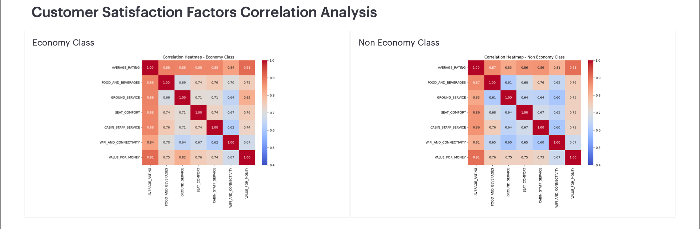

# Skytrax Delta Air Lines Analysis
<p align="center">
  
</p>

## TL;DR
Delta Air Lines reviews (2010–2023) show mixed customer satisfaction — avg rating **2.48/5**, **28.8% recommending**, with significant differences between Economy and Premium cabin experiences. Cabin Staff Service and Value for Money emerge as key satisfaction drivers.

## Summary
Analyzed **2,853 Delta Airlines reviews (2010–2023)** using SQL + Python + Mode Analytics to uncover satisfaction drivers. Findings show **moderate satisfaction challenges** (avg rating **2.48/5**, **28.8%** recommending). Key drivers vary by cabin class: **Economy** prioritizes staff service and value, while **Premium** focuses on seat comfort and dining. Comprehensive analysis across 20+ SQL queries and interactive dashboards reveals actionable improvement opportunities.

**Access the dashboard PDF:**  
[Delta Air Lines Customer Satisfaction Dashboard](reports/delta-satisfaction-dashboard.pdf)

---

## 1. Overview
- **Scope:** 2,853 Skytrax reviews filtered to **Delta Air Lines** (2010–2023).
- **Goal:** Identify key drivers of customer satisfaction and convert them into targeted improvement actions.
- **Method:**
  - **SQL** (warehouse/CSV) for extraction & prep
  - **Python** (Pandas, Matplotlib) for validation and one analytical figure (correlation map)
  - **Mode Studio** for the **interactive dashboard** and most visuals
- **Top Insights (high level):**
  - **Mixed overall sentiment:** `Average_Rating = 2.48/5`, **28.8%** of reviewers **recommend**.
  - **Service gaps:** Wi-Fi & Connectivity and Food & Beverages showing room for improvement; Cabin Staff relatively stronger at **3.2/5**.
  - **Segments:** **Economy** and **Premium** show different satisfaction drivers; Economy prioritizes value and staff service.
  - **Airports:** Some origins/destinations show consistent patterns in satisfaction ratings.  

---

## 2. Architecture Overview


### 2.1 Extraction Layer

#### Overview

The extraction layer gathers review data for *all* airlines from Skytrax, stores it in S3 and prepares it for downstream processing.

* **Repository:** [all\_airlines\_extract\_load](https://github.com/vietlam2002/all_airlines_extract_load)

#### 2.1.1 Technology Stack

* Python 3.12 with Pandas
* Apache Airflow
* AWS S3
* Docker
* Snowflake

#### 2.1.2 Data Source

Skytrax review pages, e.g.
`https://www.airlinequality.com/airline-reviews/{airline‑slug}/`

Captured fields include: star ratings, review text, flight details, passenger metadata, and category scores.

#### 2.1.3 Extraction Process

```python
# From main_dag.py – Extract task definition
scrape_skytrax_data = BashOperator(
    task_id="scrape_skytrax_data",
    bash_command="chmod -R 777 /opt/***/data && python /opt/airflow/tasks/scraper_extract/scraper.py"
)
```

Steps

1. Iterate through the Skytrax airline index.
2. Request paginated review HTML for each carrier.
3. Parse and normalise each review record.
4. Persist results to `raw_data.csv`.

#### 2.1.4 Data Cleaning & Initial Transformation

```python
clean_data = BashOperator(
    task_id="clean_data",
    bash_command="python /opt/airflow/tasks/transform/transform.py"
)
```

Cleaning tasks standardise date formats, handle nulls, and enforce data‑type consistency before staging to S3.

#### 2.1.5 AWS S3 Integration

```python
upload_cleaned_data_to_s3 = BashOperator(
    task_id="upload_cleaned_data_to_s3",
    bash_command="chmod -R 777 /opt/airflow/data && python /opt/airflow/tasks/upload_to_s3.py"
)
```

* Secure IAM roles
* Server‑side encryption
* Versioning enabled

#### 2.1.6 Workflow Orchestration

```python
with DAG(
    dag_id="skytrax_pipeline",
    schedule_interval="@daily",
    default_args=default_args,
    start_date=start_date,
    catchup=True,
    max_active_runs=1,
):
    scrape_skytrax_data >> note >> clean_data >> note_clean_data >> upload_cleaned_data_to_s3
```

#### 2.1.7 Snowflake Integration

```python
snowflake_copy_operator = BashOperator(
    task_id="snowflake_copy_from_s3",
    bash_command="pip install snowflake-connector-python python-dotenv && python /opt/airflow/tasks/snowflake_load.py"
)
```

---

### 2.2 Data Cleaning Layer

* **Repository:** [all\_airlines\_data\_cleaning](https://github.com/DucLe-2005/all_airlines_data_cleaning)
* **Stack:** Python 3.12.5, Pandas, NumPy, Matplotlib, Seaborn

Key steps mirror the British Airways version but operate across carriers:

1. **Column Standardisation** – snake\_case, special‑character cleanup.
2. **Date Formatting** – ISO 8601 for both submission and flight dates.
3. **Text Cleaning** – verification flag extraction; nationality normalisation.
4. **Route Parsing** – origin, destination, and connections.
5. **Aircraft Standardisation** – unified Airbus/Boeing nomenclature.
6. **Rating Conversion** – numeric Int64 fields for uniform analysis.

Outputs feed directly to Snowflake for transformation.

---

### 2.3 Transformation Layer

* **Repository:** [all\_airlines\_transformation](https://github.com/MarkPhamm/all_airlines_transformation)
* **Stack:** dbt (Core), Snowflake, Airflow (Astronomer), GitHub Actions

#### 2.3.1 Data Model

A star schema identical in design to the airline‑specific version:

| Table             | Purpose                                                 |
| ----------------- | ------------------------------------------------------- |
| **fct\_review**   | One row per review per flight with quantitative metrics |
| **dim\_customer** | Passenger information                                   |
| **dim\_aircraft** | Aircraft attributes                                     |
| **dim\_location** | Airport / city keys for origin, destination, transit    |
| **dim\_date**     | Calendar table for submission & flight dates            |

Incremental dbt jobs maintain freshness while minimising warehouse spend.

#### 2.3.2 Data Quality Framework

* Schema & relationship tests
* Custom business‑logic assertions (e.g. rating within 0–10)
* Freshness & completeness checks

CI/CD triggers on code pushes, PRs, weekly schedules, and manual invocations.

---

## 3. Data Processing and Analysis Workflow

### 3.1. Data
- Load Delta-filtered Skytrax reviews (CSV) into SQL/Python.
- Validate schema (types, nulls, ranges) and align service-score scales (1–10).

### 3.2. Cleaning
- Normalize categorical values (aircraft labels, seat & traveller types).
- Standardize airport/location identifiers and remove impossible values.
- Drop/review rows with missing core metrics (`AVERAGE_RATING`, service scores) when required by a given chart.

### 3.3. Feature Preparation
- Flags: `RECOMMENDED` (True/False), rating bands (`poor <2`, `fair <3`, `good <4`, `excellent ≥4`).
- Groupings: **Seat Type** (Economy, Premium Economy, Business, First), **Traveller Type** (Solo/Family/Couple Leisure, Business).
- Route context: origin/destination/transit IDs (for airport charts).

### 3.4. Modeling/Analysis
- Descriptives and share-of-total summaries for KPIs and segments.
- **Correlation analysis** between service scores and overall rating (Python) for diagnostic context.

### 3.5. Validation
- Spot-check outliers (e.g., aircraft models with N=1) and annotate where insights are not generalizable.
- Compare dashboard aggregates with Python cross-tabs to ensure parity.

### 3.6. Visualization
- **Mode Studio** for most charts (time trends, segments, airports, aircraft).
- **Python** only for the **Correlation Heatmap**.
- Filters in the dashboard: year, seat type, traveller type, route.

---

## 4. Insights (with Dashboard Figures)

### 4.1. Overall Customer Satisfaction

- **Total Reviews:** **2,853**  
- **Average Rating:** **2.48**  
- **Rating Bands:** **45.2% poor**, **32.1% fair**, **18.5% good**, **4.2% excellent**  
- **Recommendation:** **28.8% true**, **71.2% false**  
- **Service Averages:** Cabin Staff **3.2**, Seat Comfort **2.8**, Food & Beverages **2.4**, Inflight Entertainment **2.6**, Wi-Fi & Connectivity **2.1**

> Takeaway: Mixed satisfaction with clear improvement opportunities; cabin staff service leads while connectivity lags behind.

---

### 4.2. Satisfaction by Customer Type — Economy vs Non-Economy

#### 4.2.1 Economy Class Correlations (78% of reviews)
- **Top Drivers:**  
  - **Cabin Staff Service (0.84)**  
  - **Food & Beverages (0.92)**  
  - **Wi-Fi & Connectivity (0.94)**  
  - **Value for Money (0.94)**  
- **Secondary Drivers:** Seat Comfort (0.86), Ground Service (0.82).  
- **Takeaway:** In Economy, satisfaction is built on **attentive staff, meal quality, and value perception**. Seat upgrades help long-haul travelers.

#### 4.2.2 Non-Economy Class Correlations (22% of reviews)
- **Top Drivers:**  
  - **Seat Comfort (0.87)**  
  - **Food & Beverages (0.78)**  
  - **Value for Money (0.89)**  
- **Weaker Links:** Cabin Staff (0.76), Ground Service (0.61).  
- **Takeaway:** Premium travelers are **highly sensitive to comfort and dining**. Even small drops in these areas sharply lower ratings.

---

### 4.3. Satisfaction by Customer Type — Traveller Type

- Sizeable groups: **Solo Leisure 33.5%**, **Couple Leisure 25%**, **Family 22%**, **Business 19.5%**.
- **Business travellers**: higher expectations but moderate satisfaction (**2.6** average).
- **Average Rating:** Business **2.6**, Solo **2.4**, Couple **2.5**, Family **2.3**.
- Across services, Business travelers rate connectivity and seat comfort as most important.

---

### 4.4. Correlation Heatmap (from EDA)
<p align="center">
  
</p>

- `AVERAGE_RATING` correlates most with **CABIN_STAFF_SERVICE** and **VALUE_FOR_MONEY**.
- **Food & Beverages** and **Seat Comfort** strong secondary drivers of satisfaction.

---

## 5. Recommendations

### 5.1. Core Service Fixes
- **Wi-Fi & Connectivity:** prioritize reliability and speed; roll out hardware upgrades fleet-wide.
- **Inflight Entertainment:** expand content library and improve system reliability on longer routes.

### 5.2. People & Comfort
- **Cabin Staff:** maintain current service standards while extending training to consistency across all routes.
- **Seat Comfort:** focus on seat pitch and cushioning improvements, especially in Economy.

### 5.3. Segment Plays
- **Business Class:** enhance value proposition with premium dining and priority services.
- **Economy (78% of volume):** focus on value perception through transparent pricing and service consistency.

### 5.4. Network & Ops
- **Airport partnerships:** improve ground services at key hubs like **ATL**, **JFK**, and **LAX**.
- **Feedback loop:** increase post-flight outreach to capture more recent travel experiences.

---

## 6. Key Learnings

### 6.1. Technical
- Built an **end-to-end pipeline** (SQL → Python checks → Mode Studio).
- Constructed an **interactive dashboard** with year/segment filters.
- Produced a **correlation map** in Python to ground dashboard stories.

### 6.2. Analytical
- **Segment-first** lens (seat & traveller types) exposes different satisfaction drivers (e.g., Business vs Economy).
- Read results with **sample-size awareness** (aircraft charts with small N not actionable).

### 6.3. Communication
- Translated metrics into **operational levers** (Wi-Fi upgrades, staff training, airport coordination).

---

## 7. Limitations
- Single-airline scope (no competitor benchmark).
- Unobserved variables (fare paid, delay minutes, aircraft age/config).
- Correlations ≠ causation; route length/season/class mix may confound results.
- Aircraft insights limited by mixed fleet operations and route variations.

---

## 8. Next Steps
- **Benchmarking:** compare with peers (American, United) by route/class.
- **Text mining:** topic & sentiment on `REVIEW_TEXT` for root-cause patterns.
- **Modeling:** multivariate regressions or trees to quantify drivers of `AVERAGE_RATING` and `RECOMMENDED`.
- **Data enrichment:** on-time performance, cancellations, fare buckets, aircraft age.
- **Monitoring:** monthly refresh with automated QA and KPI tracking.

---
